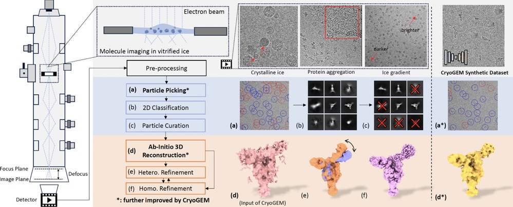
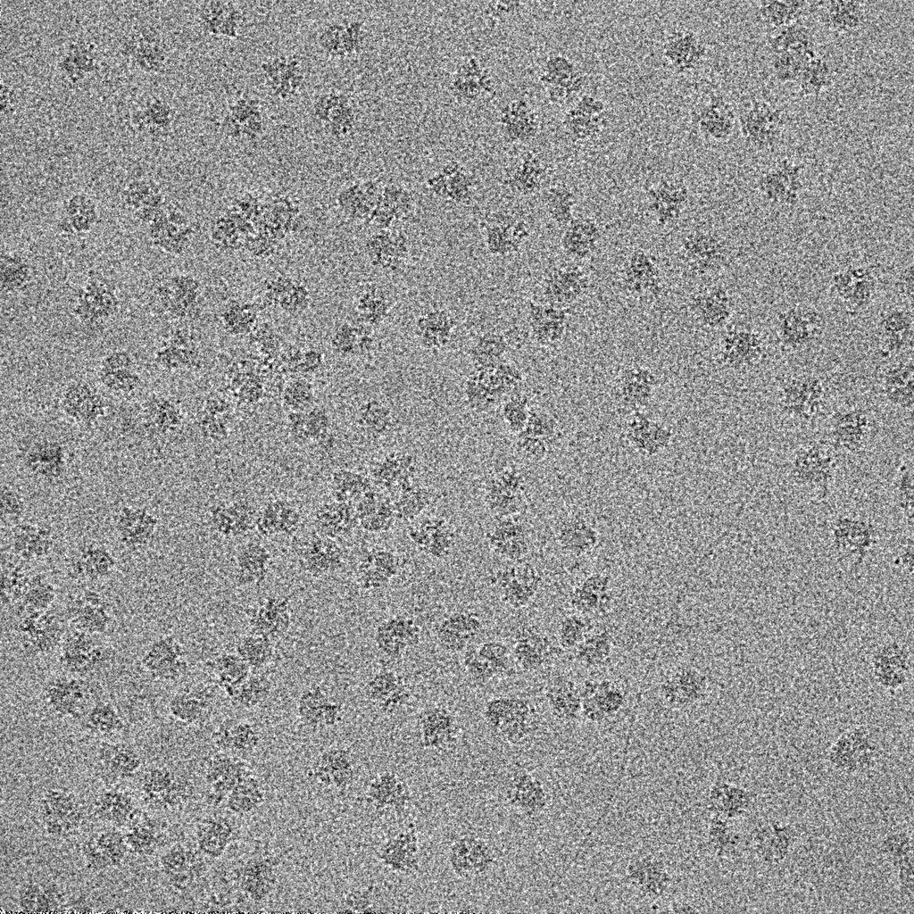

## CryoGEM💎 : Physics-Informed Generative Cryo-Electron Microscopy

Accepted by NeurIPS 2024🎉🎉🎉

[Jiakai Zhang](https://jiakai-zhang.github.io), [Qihe Chen](https://github.com/Dylan8527), [Yan Zeng](https://zerone182.github.io), Wenyuan Gao, Xuming He, Zhijie Liu, Jingyi Yu

<p align="center">
  
</p>

## TODOs
- [ ] Supporting AlphaFold predicted results as inputs
- [ ] Generalization capability
- [ ] More advanced controllability

## 🔧 Dependencies and Installation

- Python >= 3.7 (Recommend to use [Anaconda](https://www.anaconda.com/download/#linux) or [Miniconda](https://docs.conda.io/en/latest/miniconda.html))
- [PyTorch &gt;= 1.7](https://pytorch.org/)

### Installation

1. Clone repo

   ```bash
   cd cryoGEM
   ```
2. create conda envionment and activate

```bash
conda create -n cryogem python=3.11
conda activate cryogem

```

3. Install cryoGEM

```bash
   pip install -e . # tested on Ubuntu 20.04 with a single NVIDIA RTX 3090 GPU.
```

### Dataset

As the dataset is too large to upload, please download [data.zip](https://www.dropbox.com/scl/fi/0zczm5hlb1h8qes1kobhz/data.zip?rlkey=46ob2ywa80t1mcvezy4lj6tu2&st=626po0mp&dl=0) on Dropbox, and unzip it to `testing/` .

---

# Toturial

## 1. Prepare clean micrographs for training and testing

```console
Usage: cryogem gen_data [options] ...
  -h                              show help
  --device                        device to run the code [cuda:0]
  --save_dir                      directory to save the projection micrographs
  --mode                          mode of the dataset [homo | hetero]
  --input_map                     (homo) input map file 
  --symmetry                      (homo) symmetry of volume [C1, D7...]
  --drgn_dir                      (hetero) cryodrgn result directory
  --drgn_epoch                    (hetero) cryodrgn checkpoint index
  --n_micrographs                 number of micrographs to generate [10]
  --micrograph_size               micrograph size [1024]
  --particles_mu                  (Gaussian sampler) mean particles per micrograph
  --particles_sigma               (Gaussian sampler) sigma of distribution
  --particle_collapse_ratio       larger -> more dense particles (0~1)
  --mask_threshold                threshold for particle mask   
Example(homo):
  # training dataset
  cryogem gen_data --mode homo --device cuda:0 \
  --input_map testing/data/exp_abinitio_volumes/densitymap.10028.90.mrc \
  --save_dir save_images/gen_data/Ribosome\(10028\)/training_dataset/ \
  --n_micrographs 100 --particle_size 90 --mask_threshold 0.9
  # testing dataset
  cryogem gen_data --mode homo --device cuda:0 \
  --input_map testing/data/exp_abinitio_volumes/densitymap.10028.90.mrc  \
  --save_dir save_images/gen_data/Ribosome\(10028\)/testing_dataset/ \
  --n_micrographs 1000 --particle_size 90 --mask_threshold 0.9
Example(hetero):
  # training dataset
  cryogem gen_data --mode hetero --device cuda:0 --drgn_epoch 49 \
  --drgn_dir testing/data/exp_abinitio_volumes/10345_neural_volume/drgn_result \
  --save_dir save_images/gen_data/Integrin\(10345\)/training_dataset/ \
  --n_micrographs 100 --particle_size 100 --mask_threshold 0.7 
  # testing dataset
  cryogem gen_data --mode hetero --device cuda:0 --drgn_epoch 49 \
  --drgn_dir testing/data/exp_abinitio_volumes/10345_neural_volume/drgn_result \
  --save_dir save_images/gen_data/Integrin\(10345\)/testing_dataset/ \
  --n_micrographs 1000 --particle_size 100 --mask_threshold 0.7 
```

Below are dataset settings in our paper, you can use them to reproduce the result in our paper. To keep this codebase is easy to clone, we only upload homo reconstruction results in this anonymous verision. Please contact us for the neural volume weights of Intergrin if you are interested in reproducing the heterogeneous results of CryoGEM.

<div class="center">

|      Dataset      | Symmetry | Micrograph$n_{train}/n_{test}$ | Micrograph$\text{N}\times\text{N}$ | Particles$\mu$ | Particles$\sigma$ | Particle collapse ratio | Mask threshold |
| :---------------: | :------: | :------------------------------: | :----------------------------------: | :--------------: | :-----------------: | :---------------------: | :------------: |
| Proteasome(10025) |    D7    |             100/1000             |              1024x1024              |      245.88      |        33.62        |          0.75          |      0.9      |
|  Ribosome(10028)  |    C1    |             100/1000             |              1024x1024              |      97.52      |        13.64        |          0.50          |      0.9      |
|  Integrin(10345)  |    C1    |             100/1000             |              1024x1024              |      42.41      |        17.45        |          0.40          |      0.7      |
|  PhageMS2(10075)  |    C1    |             100/1000             |              1024x1024              |      35.42      |        17.74        |          0.50          |      0.9      |
|  HumanBAF(10590)  |    C1    |             100/1000             |              1024x1024              |      150.44      |        17.06        |          0.55          |      0.9      |

</div>

# 2. Estimate ice gradient for real images

Before training, we need to estimate the real ice gradient from the real data for a more accurate simulation.

```console
Usage: cryogem esti_ice [options] ... 
  -h                              show help
  --apix                          pixel size (Angstrom) [1.0]
  --input_dir                     (required) input micrograph directory
  --save_dir                      (required) save directory
  --output_len                    length if estimated ice gradient [1024]
  --device                        device to run the code [cuda:0]
Example:
  cryogem esti_ice --apix 5.36 --device cuda:0 \
  --input_dir testing/data/Ribosome\(10028\)/real_data/ \
  --save_dir save_images/esti_ice/Ribosome\(10028\)/ 
```

The paired image and estimated ice gradient should be like below:

<p align="center">
  
  
</p>

<div class="center">

|      Dataset      | Apix | Ice Gradient$\text{N}\times\text{N}$ |
| :---------------: | :--: | :------------------------------------: |
| Proteasome(10025) | 4.62 |               1024x1024               |
|  Ribosome(10028)  | 5.36 |               1024x1024               |
|  Integrin(10345)  | 4.04 |               1024x1024               |
|  PhageMS2(10075)  | 4.64 |               1024x1024               |
|  HumanBAF(10590)  | 4.50 |               1024x1024               |

</div>

# 3. Train CryoGEM model

If you want to use your own dataset or model, please modify the dataset and model configuration in the [config file](cryogem/config.py) and create custom dataset according to [template dataset](cryogem/datasets/template_dataset.py) and custom model according to [template model](cryogem/models/template_model.py).

```console
Usage: cryogem train [options] ...
  -h                              show help
  --name                          experiment name [empiar-10028-test]
  --gpu_ids                       GPU ids, -1 for CPU [0]
  --ngf                           # of gen filters in first conv [64]
  --ndf                           # of discrim filters in first conv [128]
  --netD                          discriminator [basic | n_layers | pixel]
  --n_layers_D                    only used if netD==n_layers [3]
  --netG                          generator architecture [unet_1024]
  --norm                          instance/batch normalization [instance]
  --no_dropout                    no dropout for the generator [True]
  --batch_size                    input batch size [1]
  --crop_size                     cropped image size [1024]
  --n_epochs                      epochs with initial learning rate [25]
  --n_epochs_decay                epochs to linearly to zero [75]
  --lr                            initial learning rate for adam [1e-4]
  --lr_policy                     learning rate policy.[linear]
  --max_dataset_size              maximum loading images [100]
  --apix                          pixel size (Angstrom) [5.36]
  --real_dir                      directory of real images 
  --sync_dir                      directory of sync images 
  --mask_dir                      directory of particle masks
  --weight_map_dir                directory of real ice gradients
Example:
  cryogem train --name empair-10028-test --max_dataset_size 100 --apix 5.36 --gpu_ids 0 \
  --real_dir testing/data/Ribosome\(10028\)/real_data/ \
  --sync_dir save_images/gen_data/Ribosome\(10028\)/training_dataset/mics_mrc \
  --mask_dir save_images/gen_data/Ribosome\(10028\)/training_dataset/particles_mask \
  --weight_map_dir save_images/esti_ice/Ribosome\(10028\)/ 
```

You can check the intermediate results (`checkpoints/empair-10028-test/web/images`) and training logs (`checkpoints/empair-10028-test/loss_log.txt`)

# Test CryoGEM Model

After the model is trained, you can test it to generate cryoGEM synthetic dataset. The test dataset should be previously created by `gen_data`.

```console
Usage: cryogem test [options] ...
  -h                              show help
  --name                          experiment name [empiar-10028-test]
  --gpu_ids                       GPU ids, -1 for CPU [0]
  --ngf                           # of gen filters in first conv [64]
  --netG                          generator architecture [unet_1024]
  --norm                          instance/batch normalization [instance]
  --batch_size                    input batch size [1]
  --crop_size                     cropped image size [1024]
  --num_test                      number of generated images [1000]
  --max_dataset_size              maximum loading images [1000]
  --apix                          pixel size (Angstrom) [5.36]
  --sync_dir                      directory of sync images
  --mask_dir                      directory of particle masks
  --pose_dir                      directory of particle location 
  --weight_map_dir                directory of real ice gradients
  --save_dir                      directory to save the generated images
  --generate_shift                if true, store shifted particles [False]
  --pixel_shift_max               max pixel for particle shift [5]
Example:
  cryogem test --name empair-10028-test \
  --max_dataset_size 1000 --num_test 1000 --apix 5.36 --gpu_ids 0 \
  --sync_dir save_images/gen_data/Ribosome\(10028\)/testing_dataset/mics_mrc \
  --mask_dir save_images/gen_data/Ribosome\(10028\)/testing_dataset/particles_mask \
  --pose_dir save_images/gen_data/Ribosome\(10028\)/testing_dataset/mics_particle_info \
  --weight_map_dir save_images/esti_ice/Ribosome\(10028\)/ \
  --save_dir save_images/test/Ribosome\(10028\)/ 
```

# Results

By following the testing commands, you can check the folder `save_images/test/Ribosome(10028)/genem/empair-10028-test/mics_png_fake_B`. `_A` stands for the physical simulation domain, `_B` stands for the real cryo-EM data domain. So `fake_B` is the folder with synthetic results. We also provide the annotations of particle picking (`save_images/test/Ribosome(10028)/cryogem/empair-10028-test/particles.star`) and the annotations of pose estimation (`save_images/test/Ribosome(10028)/cryogem/empair-10028-test/gt_pose.pkl`)

# Acknowledgement
Many thanks to Qihe Chen, who is the main contributor to the code writing! This project has borrowed some code from [CUT](https://github.com/taesungp/contrastive-unpaired-translation) and [cryoDRGN](https://github.com/ml-struct-bio/cryodrgn). This project is supported by ShanghaiTech University, Cellverse.

# Citation
```
@article{zhang2024cryogem,
  title={CryoGEM: Physics-Informed Generative Cryo-Electron Microscopy},
  author={Zhang, Jiakai and Chen, Qihe and Zeng, Yan and Gao, Wenyuan and He, Xuming and Liu, Zhijie and Yu, Jingyi},
  journal={Advances in Neural Information Processing Systems},
  volume={38},
  year={2024}
}
```

# Contact

For any help and further discussions, feel free to open a new issue or directly contact ``zhangjk@shanghaitech.edu.cn`` and ``qihe2024@shanghaitech.edu.cn``

